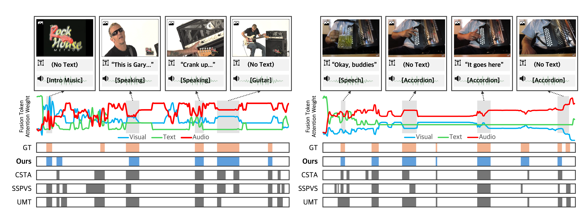

# TripleSumm: Adaptive Triple-Modality Fusion for Video Summarization (ICLR 2026)

> Official PyTorch implementation of ***"TripleSumm: Adaptive Triple-Modality Fusion for Video Summarization"***.

<p align="center">
  <a href="https://smkim37.github.io/TripleSumm-page/"></a>&nbsp;&nbsp;&nbsp;
  <a href="https://arxiv.org/abs/2603.01169"></a>&nbsp;&nbsp;&nbsp;
  <a href="https://arxiv.org/pdf/2603.01169"></a>
</p>

<p align="center">
  <p align="center">
    <a href="https://www.linkedin.com/in/smkim37" target='_blank'>Sumin Kim</a><sup>*</sup>&emsp;
    <a href="https://www.linkedin.com/in/hyemin-jeong/" target='_blank'>Hyemin Jeong</a><sup>*</sup>&emsp;
    <a href="https://rkdrn79.github.io/" target='_blank'>Mingu Kang</a><sup>*</sup>&emsp;
    <a href="https://www.linkedin.com/in/yejin-kim-4479392a6/" target='_blank'>Yejin Kim</a>&emsp;
    <a href="https://yoori000.github.io/" target='_blank'>Yoori Oh</a><sup>†</sup>&emsp;
    <a href="http://www.joonseok.net/home.html" target='_blank'>Joonseok Lee</a><sup>†</sup>
  </p>
  <p align="center">
    Seoul National University
  </p>
  <p align="center">
    <sup>*</sup>Equal Contribution. <sup>†</sup>Corresponding Author.
  </p>
</p>





## 📢 News

- 🚀 **[Mar 2026]** The **official code**, **pretrained checkpoints**, and **datasets** are now publicly available!
- 🚀 **[Mar 2026]** The **camera-ready paper** is now available on arXiv!
- 🚀 **[Jan 2026]** TripleSumm has been accepted to **ICLR 2026**. See you in **Rio de Janeiro, Brazil** 🇧🇷


## Table of Contents

- [📢 News](#news)
- [🛠️ Installation](#installation)
- [🗂️ Data](#data)
- [💾 Pretrained Checkpoints](#pretrained-checkpoints)
- [🧪 Evaluation](#evaluation)
- [🏋️ Training](#training)
- [📝 Citation](#citation)
- [⚖️ License](#license)


## 🛠️ Installation

The code was tested with the following environment:

- Python 3.10.20
- PyTorch 2.5.1
- CUDA 12.1
- GPU: NVIDIA RTX A6000 (48GB)

To set up the environment, run:

```bash
git clone https://github.com/smkim37/TripleSumm.git
cd TripleSumm

conda create -y -n triplesumm python=3.10
conda activate triplesumm

conda install -y pytorch torchvision torchaudio pytorch-cuda=12.1 -c pytorch -c nvidia
pip install -r requirements.txt
```


## 🗂️ Data

The multimodal features and annotations used in this project are available on **Hugging Face** 🤗.
* [MoSu Dataset](https://huggingface.co/datasets/hminjeong/TripleSumm-MoSu)
* [Mr. HiSum Dataset](https://huggingface.co/datasets/hminjeong/TripleSumm-Mr.HiSum)


### MoSu Dataset

The MoSu dataset repository provides metadata, pre-extracted multimodal features, ground-truth annotations, and dataset splits. It contains 52,678 videos with synchronized visual, text, and audio features. The feature files are distributed in HDF5 format, and each modality file is approximately 40GB.

### Mr. HiSum Dataset

Mr. HiSum is a large-scale dataset for video highlight detection and summarization introduced in a **NeurIPS 2023 Datasets and Benchmarks** paper. The original dataset contains 31,892 videos, while the version used in TripleSumm provides features for **30,452 videos**, excluding samples that could not be processed because they were no longer accessible.

The released repository includes metadata, pre-extracted multimodal features, ground-truth annotations, and dataset splits for the reproduced multimodal version used in TripleSumm. Visual features use InceptionV3, while text and audio features use RoBERTa and AST, respectively.

For more details, please refer to the [NeurIPS 2023 paper](https://proceedings.neurips.cc/paper_files/paper/2023/file/7f880e3a325b06e3601af1384a653038-Paper-Datasets_and_Benchmarks.pdf) or the [official GitHub repository](https://github.com/MRHiSum/MR.HiSum).

### Directory Structure

Please download the dataset files and place them under the `data/` directory as follows:

```text
data/
├── mosu/
└── mrhisum/
```

Please make sure that the dataset paths used in the corresponding shell scripts are correctly set for your local environment.


## 💾 Pretrained Checkpoints

Pretrained checkpoints are available on [Hugging Face](https://huggingface.co/smkim37/TripleSumm) 🤗.

- `best_model_ckpt_mosu.pth`: pretrained checkpoint for **MoSu**.
- `best_model_ckpt_mrhisum.pth`: pretrained checkpoint for **Mr. HiSum**.

Please download the appropriate checkpoint file and place it under:

```text
checkpoints/
├── best_model_ckpt_mosu.pth
└── best_model_ckpt_mrhisum.pth
```

Please also make sure that the `model_ckpt` path in the corresponding evaluation shell script points to the downloaded checkpoint file.


## 🧪 Evaluation

To evaluate TripleSumm, please run the appropriate shell script for each dataset:

### MoSu

```bash
bash scripts/eval_mosu.sh
```

### Mr. HiSum

```bash
bash scripts/eval_mrhisum.sh
```

Before running evaluation, please make sure that the `data_dir` and `model_ckpt` paths in the corresponding shell script are correctly set for your local environment.

> **Note**: Evaluation requires a pretrained checkpoint. Therefore, `model_ckpt` must point to a valid checkpoint file before running the script.


## 🏋️ Training

To train TripleSumm, please run the appropriate shell script for each dataset:

### MoSu

```bash
bash scripts/train_mosu.sh
```

### Mr. HiSum

```bash
bash scripts/train_mrhisum.sh
```

Before running training, please make sure that the `data_dir` path in the corresponding shell script is correctly set for your local environment.

> **Note**: Weights & Biases logging is currently disabled in the provided shell scripts. If you want to enable it, please add the `--wandb` option to the command in the shell script.


## 📝 Citation

```bibtex
@inproceedings{kimtriplesumm,
  title={TripleSumm: Adaptive Triple-Modality Fusion for Video Summarization},
  author={Kim, Sumin and Jeong, Hyemin and Kang, Mingu and Kim, Yejin and Oh, Yoori and Lee, Joonseok},
  booktitle={The Fourteenth International Conference on Learning Representations},
  year={2026}
}
```

## ⚖️ License

This project is licensed under the MIT License. See the `LICENSE` file for details.
